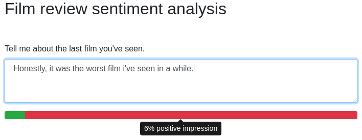

# Review Sentiment CNN

*What does he mean by what he says?* - We provide a simple web demo 
of a neural network model rating the sentiment of arbitrary English sentences as positive or negative.

The task and model is inspired by or even based on [1].
The model has one convolution layer (learn more about convolution in [4]) with filters of size $\{3, 4, 5\}$, max pooling over the whole sentence and a fully connected layer with sigmoid activation.
For training and testing we use sentences of 2000 reviews of the IMDB [2], annotated as positive or negative.
Sentences are transformed to matrices using pretrained [Word2Vec](https://code.google.com/archive/p/word2vec/) modelss.

This repository provides everything you need to simply run the web demo in a container or even preprocess data, train, and test the model yourself.



## Getting Started

*Note:* In this section you learn how to install dependencies, train and test the model.
If you are just interested in running the web interface with a pretrained model, see (#deployment-with-docker).

### Prerequisite

This introduction assumes you're using a modern *Linux* system. The commands and steps may differ on *macOS* or *Windows*.

For the data and models you require several gigabyte of free disk space and RAM. 
A GPU or fast and multi core CPU isn't mandatory but will speed up training a lot.

On your system, you require [Python 3](https://www.python.org/downloads/) with the installed python package manager *pip* and access to a command line shell.

```sh
$ python3 --version
Python 3.6.4

$ pip3 --version
pip 9.0.1 from /usr/lib/python3.6/site-packages (python 3.6)
```

### Requirements

The most important python requirements are listed in *requirements.txt*.
Just install all of them.

```sh
$ pip3 install -r requirements.txt --user
```

A pretrained *Word 2 Vec* model (english, 300.000 entries) has to be downloaded. *Warning: Will take a while cause it downloads, unzips, and saves several gigabyte*.

```sh
$ python3 download_word2vec.py
```

As a simple dataset for training and testing the model, we use annotated sentences of movie reviews.
Download [polarity dataset v2.0](http://www.cs.cornell.edu/people/pabo/movie-review-data/) and save the unzipped folder *review_polarity* in the *./data/* directory. This is not necessary if you only want to use the web demo with the provided pretrained model.

### Preprocess data

Sentences cannot be processed as text by our CNN model. 
Therefore words are transformed to fixed sized vectors using the pretrained word2vec model.
The sentence matrices of word vectors and the positive/negative labels can be created and stored with a single command.
Sentences will be zero padded or cut to a fixed matrix size.
The command also already randomizes and splits the dataset into a training, validation and test set.
*Warning: The created files are a few gigabytes in size.*

```shell
$ python3 generate_data.py
```

### Model definition and training

The model definition can be modified and trained using the `train_model.py` file with the [pregenerated data](#preprocess-data).
While training the error on the validation set is printed and the trained model is safed as `data/model.h5`.
*Warning: Training the model take some time and consume a lot of CPU/GPU and RAM resources*.

```shell
$ python3 train_model.py
```

### Test model

To get an approximation of the model's estimation accuracy on unseen data you can use the handoff test set.

```shell
$ python3 test_model.py
```

### Compare to linear model 

The [test performance](#test-model) of our CNN model can be compared to a simple linear logistic regression model (no network magic!).
This script requires an additional dependency.


```shell
$ pip3 install scikit-learn --user
$ python3 linear_baseline.py
```

### Web Demo

You can start the web demo with the following command and visit in your browser [http://localhost/](http://127.0.0.1/).
[Preprocessing](#preprocess-data) and [training](model-defintion-and-training) is not necessary, because a pretrained model is provided in this repository.

*Warning: This demo is experimental only. We cannot define it as secure or stable. Use at your own risk*

```shell
$ python3 web_demo.py
```

## Deployment with Docker

The simplest way to deploy and use the web interface is via a Docker container.
You don't have to prepare any dependencies beside this repositories content and [Docker installed on your computer](https://docs.docker.com/engine/installation/**.
It should work similar on all major OS.

*Warning: This demo is experimental only. We cannot define it as secure or stable. Use at your own risk*

### Build and start

Build the docker image defined in the *Dockerfile*.

```sh
$ docker build -t cnn-review .
```

Run the image with the web demo. The container may take some time to setup everything to start.

```shell
$ docker run --name cnn-review -d cnn-review:latest
```

### Use the demo 

Visit the web demo in your browser on the IP of your container.

You'll find the IP via `docker inspect cnn-review | grep -m 1 '"IPAddress"'`

### Stop and cleanup

If you've finished using the demo, you can stop and remove the container.

```shell
$ docker stop cnn-review
$ docker rm cnn-review
```

## About

The basis of this project got created as a demo for a seminar talk about CNNs in the natural language processing context at *University of Freiburg*.

You use everything in this repository under the terms of [MIT License](LICENSE.txt).
Notwithstanding, you should check and respect the terms of the data set and word2vec models you use. 

## References

- [1] Model definition: *Kim, Y. (2014). Convolutional Neural Networks for Sentence Classification. Proceedings of the 2014 Conference on Empirical Methods in Natural Language Processing (EMNLP 2014), 1746–1751.*
- [2] Data set: *First used in Bo Pang and Lillian Lee, "A Sentimental Education: Sentiment Analysis Using Subjectivity Summarization Based on Minimum Cuts",  Proceedings of the ACL, 2004.*
- [3] [Implementing a CNN for text classification in tensorflow](http://www.wildml.com/2015/12/implementing-a-cnn-for-text-classification-in-tensorflow/)
- [4] [CNNs for NLP](http://www.wildml.com/2015/11/understanding-convolutional-neural-networks-for-nlp/)
